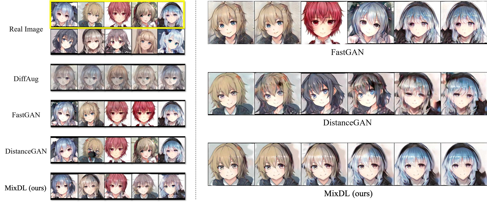
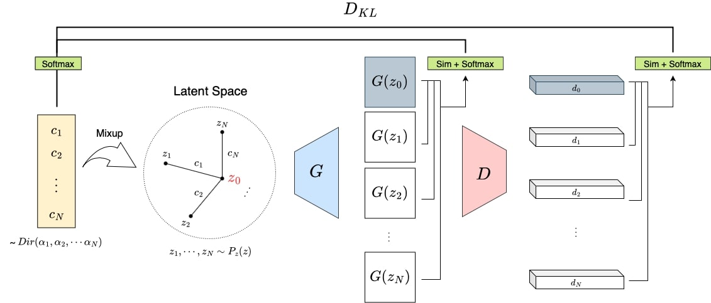
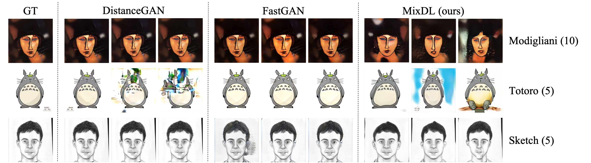
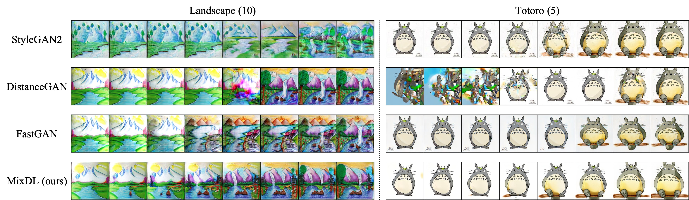

# Few-shot Image Generation with Mixup-based Distance Learning [ECCV 2022]

> Chaerin Kong, Jeesoo Kim, Donghoon Han, Nojun Kwak <br> <br>
> Producing diverse and realistic images with generative models such as GANs typically requires large scale training with vast amount of images. GANs trained with limited data can easily memorize few training samples and display undesirable properties like "stairlike" latent space where interpolation in the latent space yields discontinuous transitions in the output space. In this work, we consider a challenging task of pretraining-free few-shot image synthesis, and seek to train existing generative models with minimal overfitting and mode collapse. We propose mixup-based distance regularization on the feature space of both a generator and the counterpart discriminator that encourages the two players to reason not only about the scarce observed data points but the relative distances in the feature space they reside. Qualitative and quantitative evaluation on diverse datasets demonstrates that our method is generally applicable to existing models to enhance both fidelity and diversity under few-shot setting. Codes are available.

<a href="https://arxiv.org/abs/2111.11672"></a>
<a href="https://opensource.org/licenses/MIT"></a>
<a href="https://pytorch.org/">=1.9.0-Red?logo=pytorch"></a>





# Getting Started
## Requirements
1. This code base heavily relies on [pytorch implementation of StyleGAN2](https://github.com/rosinality/stylegan2-pytorch). We have mainly tested on 

```
- python=3.6.8
- torch=1.9.0
- CUDA=10.2
```

but we found it robust to minor version mismatches. (e.g., CUDA version upto 11.2)

2. For [FastGAN](https://arxiv.org/abs/2101.04775) implementation and dependencies, refer to their [official code base](https://github.com/odegeasslbc/FastGAN-pytorch).
We used the same aforementioned environment settings.

## Datasets
1. The datasets used in our paper is accessible through the following links. (Big thanks to the authors of [FastGAN](https://github.com/odegeasslbc/FastGAN-pytorch) and [CDC](https://github.com/utkarshojha/few-shot-gan-adaptation)).

Name | Download | Size 
---- | :------: | :--: 
Animal-Face Dog <br> Obama <br> Grumpy Cat <br> Anime Face <br> Pokemon | [Link](https://drive.google.com/u/0/uc?id=1aAJCZbXNHyraJ6Mi13dSbe7pTyfPXha0&export=download) | (975.4MB)
Oxford Flowers | [Link](https://www.robots.ox.ac.uk/~vgg/data/flowers/102/index.html) | (344.9MB)
FFHQ-babies | [Link](https://drive.google.com/file/d/1JmjKBq_wylJmpCQ2OWNMy211NFJhHHID/view) | (3.2GB) 
Sketches | [Link](https://drive.google.com/file/d/1vgsB7ji-cLVzRhx43DvNSDgV5Up3jFJ2/view) | (23MB)
Amedeo Modigliani | [Link](https://drive.google.com/file/d/1D5X2hr7Z6EnY9HoxaGJb_vEvDVpSzjbz/view) | (801KB)
Landscape | [Link](https://drive.google.com/file/d/1zYw3iTc2NM6LStHpM8sscq24EDwNkEsy/view) | (500KB)

2. Prepare your dataset as lmdb with `prepare_data.py`.

```bash
$ python3 prepare_data.py --out PATH/TO/LMDB PATH/TO/IMAGE_FOLDER
```

3. You can freely try custom datasets. Gather a handful of images (perhaps from the web), put them in a folder (i.e., IMAGE_FOLDER), and run the above code.

# Training

```bash
$ python3 train_mixdl.py
```

# Sampling

```bash
$ python3 generate.py
```





# Evaluation

```bash
$ python3 -m pytorch_fid PATH/TO/REAL_IMAGES PATH/TO/FAKE_IMAGES
```
